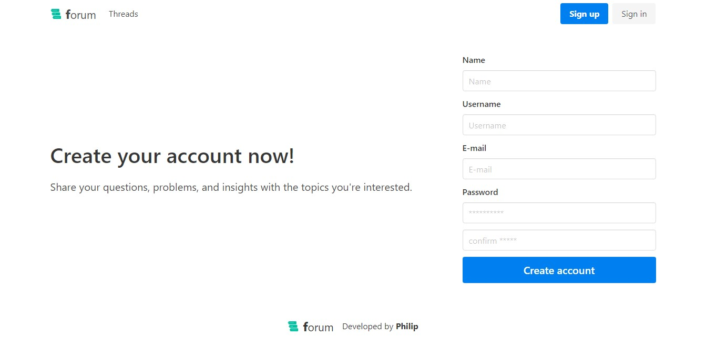

<!-- WEBSITE NAME -->
# forum

<!-- WEBSITE SCREENSHOT -->


<!-- ABOUT THE PROJECT -->
### About The Project

**forum** is a simple interactive forum website where in you can register account and create a thread about your question, problem or issues related on the topic you choose. You can also reply, follow,  and like other user threads.

List of some of its functionalities
* Register account
* Create threads
* Reply on threads
* Like threads
* Follow threads and get notified on latest replies of other users.

### Built With

* [Laravel](https://laravel.com)
* [Vue.js](https://vuejs.org)
* SASS
<!-- * [Vue2Editor](https://www.vue2editor.com/) -->

<!-- GETTING STARTED -->
### Getting Started

To get started setting up your project locally. To get a local copy up and running follow these simple steps.

### Prerequisites
Assuming you have already installed latest php, composer, node.js, npm, and git on your computer

### Installation

1. Clone the repo
   ```sh
   git clone https://github.com/wickeddd3/Forum.git
   ```
2. Install Composer packages
   ```sh
   composer install
   ```
3. Install NPM packages
   ```sh
   npm install
   ```
4. Create a copy of .env.example and rename it to .env
5. Inside .env fill up Database and Mail details.
   For development purposes you can use Mailtrap (https://mailtrap.io)
   as mail host.
6. Generate APP_KEY
   ```sh
   php artisan key:generate
   ```
7. Database Migration
   ```sh
   php artisan migrate --seed

   // --seed command will generate dummy data on your database
   ```
8. Link storage to public directory
   ```sh
   php artisan storage:link
   ```
9. Run locally
   ```sh
   php artisan serve
   ```
10. Compile assets
   ```sh
   npm run watch
   ```

<!-- CONTRIBUTING -->
### Contributing

Contributions are what make the open source community such an amazing place to be learn, inspire, and create. Any contributions you make are **greatly appreciated**.

1. Fork the Project
2. Create your Feature Branch (`git checkout -b feature/AmazingFeature`)
3. Commit your Changes (`git commit -m 'Add some AmazingFeature'`)
4. Push to the Branch (`git push origin feature/AmazingFeature`)
5. Open a Pull Request

<!-- CONTACT -->
### Contact

Philip - [https://www.linkedin.com/in/philip-andrew-pablo-501203180/](https://www.linkedin.com/in/philip-andrew-pablo-501203180/)

Project Link: [https://github.com/wickeddd3](https://github.com/wickeddd3)
